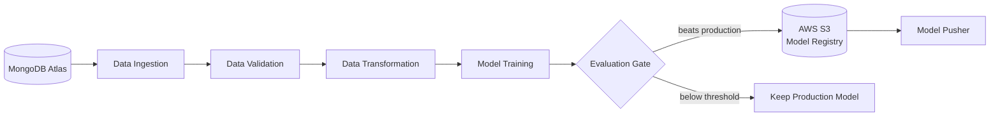
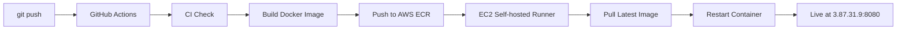
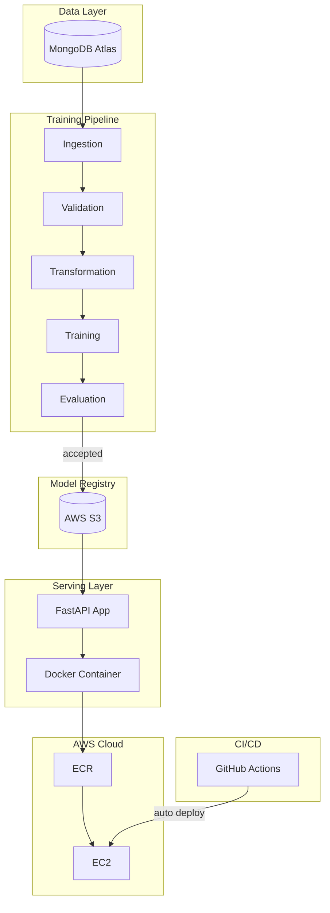

# Vehicle Insurance Cross-Sell Predictor

A production-grade MLOps pipeline that predicts whether a health insurance customer is likely to purchase vehicle insurance — built end-to-end from data ingestion to live cloud deployment.

**Live Demo:** [http://3.87.31.9:8080](http://3.87.31.9:8080)

## The Problem

Insurance companies have millions of existing health insurance customers. Reaching out to all of them to sell vehicle insurance is expensive and inefficient. This project builds a machine learning model that identifies which customers are actually likely to say yes, so the sales team can focus their efforts where it counts.

## What Makes This MLOps

This isn't just a Jupyter notebook. Every component mirrors how ML systems are built and maintained in production:

- **Automated data pipeline** — pulls fresh data from MongoDB, validates schema and detects data drift before any training happens
- **Model evaluation gate** — new models only go to production if they beat the existing model by a measurable threshold
- **Cloud model registry** — trained models are versioned and stored in AWS S3, not on someone's laptop
- **Zero-downtime deployments** — every push to GitHub automatically builds, containerizes, and deploys the updated app to EC2 without any manual steps
- **Reproducible environments** — Docker ensures the app runs identically in development and production

## Tech Stack

| Layer | Technology |
|---|---|
| Data Storage | MongoDB Atlas |
| Model Training | Scikit-learn, XGBoost |
| Model Registry | AWS S3 |
| API | FastAPI |
| Containerization | Docker |
| Container Registry | AWS ECR |
| Cloud Server | AWS EC2 |
| CI/CD | GitHub Actions |

## ML Pipeline



## CI/CD Pipeline



Every code change is automatically tested, built, and deployed. No manual SSH. No manual restarts.

## Architecture



## Some Decisions Worth Explaining

**XGBoost over other models** — The dataset is heavily imbalanced, only about 12% of customers actually respond yes. I tried logistic regression and random forest during experimentation but XGBoost consistently gave better F1 scores on the minority class without needing much manual tuning.

**The evaluation gate** — This took some thought. The naive approach is to just always deploy the newest model. But what happens when training runs on bad data, or someone tweaks the preprocessing and breaks something? The gate compares the new model against whatever is currently in S3 and only swaps it in if the F1 improves by at least 2%. It's a small safety net that prevents silent model degradation.

**Docker** — I was running into dependency conflicts between my local conda environment and what was needed on the server. Instead of managing that manually, I containerized the whole app so the environment is locked and identical everywhere. It also made the CI/CD setup much cleaner since GitHub Actions just ships an image rather than installing packages on a live server.

**Self-hosted runner** — GitHub's default runners are sandboxed and can't reach a private EC2 instance to deploy to it. I installed the runner agent directly on EC2 so it listens to GitHub and deploys locally when a new image is pushed to ECR. No SSH tunnels, no open ports beyond what's needed.

## Running Locally

You'll need Python 3.10+, a MongoDB Atlas account, and AWS credentials with S3 access.

Clone the repo and install dependencies:

```bash
git clone https://github.com/VinaySampath14/vehicle_insurance_mlops.git
cd vehicle_insurance_mlops
pip install -r requirements.txt
```

Create a `.env` file in the root with:

```
MONGODB_URL=your_mongodb_connection_string
AWS_ACCESS_KEY_ID=your_key
AWS_SECRET_ACCESS_KEY=your_secret
```

Run the app:

```bash
python app.py
```

Hit `/train` once to train the model and push it to S3. After that `/predict` works.

## API Endpoints

| Endpoint | Method | Description |
|---|---|---|
| `/` | GET | Prediction form UI |
| `/predict` | POST | Returns 0 or 1 for a given customer profile |
| `/train` | GET | Triggers the full training pipeline |
| `/docs` | GET | Interactive Swagger API documentation |

## Dataset

The dataset contains ~380,000 records of existing health insurance customers with features including age, vehicle age, prior damage history, annual premium, and sales channel. The target variable (`Response`) indicates whether the customer expressed interest in vehicle insurance.

Source: [Kaggle — Health Insurance Cross Sell Prediction](https://www.kaggle.com/datasets/anmolkumar/health-insurance-cross-sell-prediction)

## Author

**Vinay Sampath Kumar Vudumula**
[GitHub](https://github.com/VinaySampath14) · [LinkedIn](https://linkedin.com/in/vinay-sampath-kumar-vudumula)
