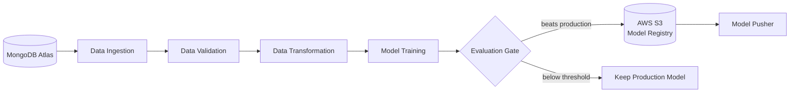
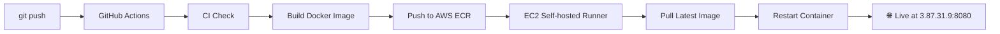
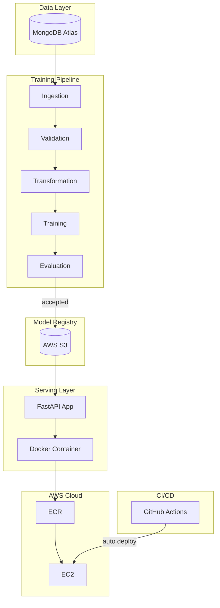

# Vehicle Insurance Cross-Sell Predictor

A production-grade MLOps pipeline that predicts whether a health insurance customer is likely to purchase vehicle insurance — built end-to-end from data ingestion to live cloud deployment.

**Live Demo:** [http://3.87.31.9:8080](http://3.87.31.9:8080)

---

## The Problem

Insurance companies have millions of existing health insurance customers. Reaching out to all of them to sell vehicle insurance is expensive and inefficient. This project builds a machine learning model that identifies which customers are actually likely to say yes — so the sales team can focus their efforts where it counts.

---

## What Makes This MLOps

This isn't just a Jupyter notebook. Every component mirrors how ML systems are built and maintained in production:

- **Automated data pipeline** — pulls fresh data from MongoDB, validates schema and detects data drift before any training happens
- **Model evaluation gate** — new models only go to production if they beat the existing model by a measurable threshold
- **Cloud model registry** — trained models are versioned and stored in AWS S3, not on someone's laptop
- **Zero-downtime deployments** — every push to GitHub automatically builds, containerizes, and deploys the updated app to EC2 without any manual steps
- **Reproducible environments** — Docker ensures the app runs identically in development and production

---

## Tech Stack

| Layer | Technology |
|---|---|
| Data Storage | MongoDB Atlas |
| Model Training | Scikit-learn, XGBoost |
| Model Registry | AWS S3 |
| API | FastAPI |
| Containerization | Docker |
| Container Registry | AWS ECR |
| Cloud Server | AWS EC2 |
| CI/CD | GitHub Actions |

---

## ML Pipeline

---

## CI/CD Pipeline

Every code change is automatically tested, built, and deployed. No manual SSH. No manual restarts.

---

## Architecture

---

## Key Design Decisions

**Why XGBoost?**
The dataset is highly imbalanced — only ~12% of customers are interested. XGBoost handles class imbalance better than logistic regression and outperformed other candidates during experimentation.

**Why the evaluation gate?**
Without it, a poorly trained model (due to bad data or a bug) could silently replace a working production model. The gate enforces a minimum F1 improvement threshold before any model goes live.

**Why Docker?**
ML projects are notorious for "works on my machine" failures. Containerizing the app guarantees the exact same Python version, package versions, and environment on every machine it runs on.

**Why self-hosted runner on EC2?**
GitHub-hosted runners can't directly deploy to a private EC2 instance. The self-hosted runner runs on EC2 itself — it listens for jobs and deploys locally, keeping the deployment fast and secure.

---

## API Endpoints

| Endpoint | Method | Description |
|---|---|---|
| `/` | GET | Prediction form UI |
| `/predict` | POST | Returns 0 or 1 for a given customer profile |
| `/train` | GET | Triggers the full training pipeline |
| `/docs` | GET | Interactive Swagger API documentation |

---

## Dataset

The dataset contains ~380,000 records of existing health insurance customers with features including age, vehicle age, prior damage history, annual premium, and sales channel. The target variable (`Response`) indicates whether the customer expressed interest in vehicle insurance.

Source: [Kaggle — Health Insurance Cross Sell Prediction](https://www.kaggle.com/datasets/anmolkumar/health-insurance-cross-sell-prediction)

---

## Author

**Vinay Sampath Kumar Vudumula**
[GitHub](https://github.com/VinaySampath14) · [LinkedIn](https://linkedin.com/in/vinay-sampath-kumar-vudumula)
